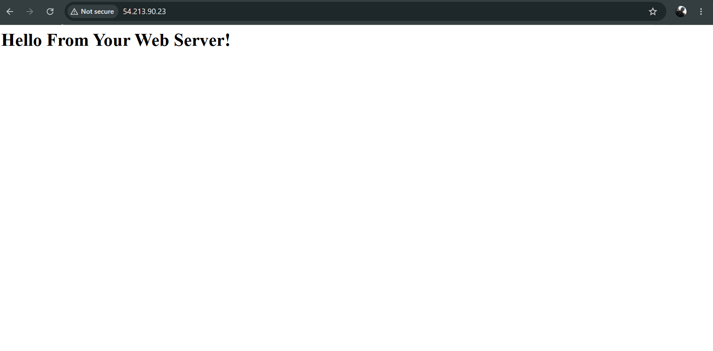
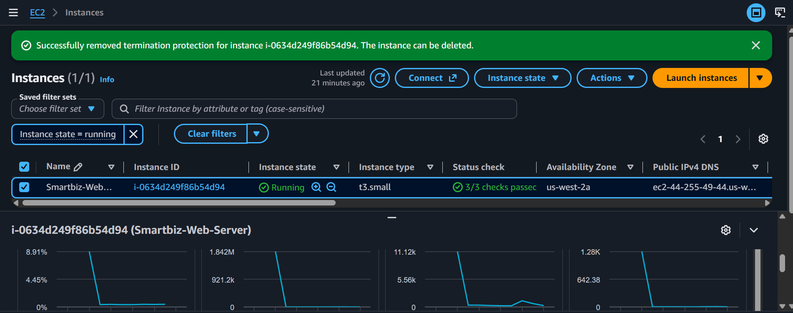
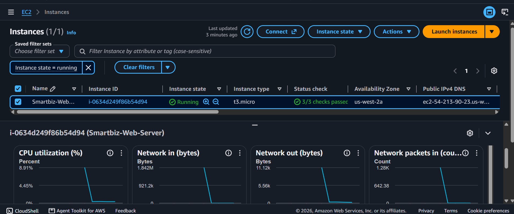

# Smartbiz-Web-Server
A scalable and resilient AWS web server deployment using Amazon Linux 2023 and Apache.
# Smartbiz Web Server

This project highlights how to deploy, secure, and scale a live web server on AWS using EC2 for business applications. The main goal here was to build a system that can handle traffic upgrades without losing configuration, while also setting up safety guards to prevent accidental deletion of infrastructure.

## What I Built
* **Infrastructure Network:** Smartbiz-VPC (Public Subnet)
* **Firewall Security:** Smartbiz-Web-SG (Port 80 Open)
* **Compute Instance:** Smartbiz-Web-Server (Amazon Linux 2023)
* **Initial Compute Size:** `t3.micro`
* **Scaled Compute Size:** `t3.small`

---

## Technical Features

### 1. Automated Web Server Deployment
Instead of configuring the server manually after boot, I used an automated bash script (`User Data`) to install, enable, and launch Apache the second the instance went live.

```bash
#!/bin/bash
yum -y install httpd
systemctl enable httpd
systemctl start httpd
echo '<html><h1>Hello From Your Web Server!</h1></html>' > /var/www/html/index.html
```

### 2. Network Security (Security Groups)
Configured firewall rules via an AWS Security Group to restrict access. I opened up **Port 80 (HTTP)** to allow global user traffic to view the web page while keeping other sensitive ports secure.

### 3. Vertical Scaling
To simulate handling a heavy traffic load, I successfully performed a vertical scale-up. I stopped the instance, modified its compute capacity from a **`t3.micro` to a `t3.small`**, and brought it back online. The server resumed hosting the web page flawlessly without needing a data reinstall.

### 4. Termination Protection
To safeguard production environments from human error, I enabled **Termination Protection**. This prevents the EC2 instance from being accidentally deleted through the console or API calls until the setting is explicitly turned off.

### 5. Infrastructure Monitoring
I used built-in AWS monitoring metrics to track the server's health and performance. This gives visibility into infrastructure utilization—like CPU spikes and network traffic—making it easy to see exactly when the instance needs to be scaled up to handle higher loads.

---

## Visual Verification

### Live Web Server
Here is the web page loading successfully via the public IP address:


### Scaling & Protection Proof
Proof of the hardware specification change and the active termination protection layout:


### Performance Monitoring
A look at the server's live performance metrics during the deployment:

